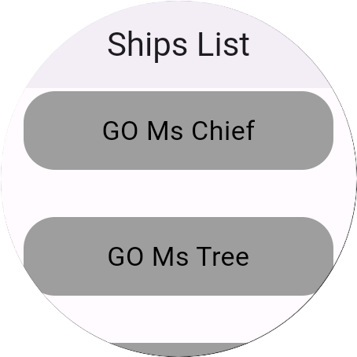

# Sample Wear OS with List

This is a sample project that supports a Wear OS app and utilizes the BLoC architecture pattern, Dio
for network management, and Drift for database handling.

NOTE: EXAMPLE ONLY FOR ANDROID

<a title="simulator_image"></a>
<a title="simulator_image"></a>

## Similar project with (Kotlin Language)

https://github.com/NicosNicolaou16/SampleWearOSComposeWithList <br />

# This Project contains:

Wear OS support <br />
Bloc Architecture Pattern with Repository and Service <br />
Dio (Network Manager) <br />
Drift Database (SQL) <br />

# References/Tutorials Follow

https://medium.com/flutter-community/flutter-building-wearos-app-fedf0f06d1b4 <br />
https://pub.dev/packages/wear <br />
https://github.com/fluttercommunity/flutter_wear_plugin <br />
https://developer.android.com/training/wearables/compose <br />

## Versions

Flutter SDK version: 3.24.4 <br />
Dart Version: 3.5.4 <br />

# Setup in Manifest

```xml

<manifest>

    <uses-feature android:name="android.hardware.type.watch" />

    <application>
        <!--other code here-->

        <!--Optional - Depend if the Wear OS App need app or note-->
        <meta-data android:name="com.google.android.wearable.standalone" android:value="true" />

        <!--other code here-->
    </application>
</manifest>
```

## Check my article

https://medium.com/@nicosnicolaou/standalone-wear-os-application-jetpack-compose-and-flutter-5a37f4775ed8

# Feeds/Urls/End Point (parsing some data from response)

## (Links References for Ends Points)

https://github.com/r-spacex/SpaceX-API (GitHub) <br />
https://docs.spacexdata.com/?version=latest (Postman) <br />
