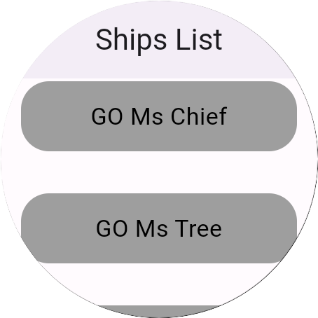

# Sample Wear OS with List

[](https://linktr.ee/nicos_nicolaou)
[](https://nicosnicolaou16.github.io/)
[](https://twitter.com/nicolaou_nicos)
[](https://linkedin.com/in/nicos-nicolaou-a16720aa)
[](https://medium.com/@nicosnicolaou)
[](https://androiddev.social/@nicolaou_nicos)
[](https://bsky.app/profile/nicolaounicos.bsky.social)
[](https://dev.to/nicosnicolaou16)
[](https://www.youtube.com/@nicosnicolaou16)
[](https://g.dev/nicolaou_nicos)

This is a sample Flutter project specifically designed for **Wear OS**. It demonstrates a robust architecture utilizing the **BLoC** pattern, **Dio** for network management, and **Drift** (formerly Moor) for local database persistence and offline support.

> [!IMPORTANT]
> **NOTE: EXAMPLE FOR ANDROID (WEAR OS) ONLY.**

<p align="center">
  
  
</p>

## 🚀 Technologies Used

*   **[Wear OS Support](https://developer.android.com/training/wearables):** Tailored UI for circular and square smartwatch screens, battery optimization, and wearable-specific features.
*   **[Bloc Pattern](https://bloclibrary.dev/):** Manages state and separates business logic from the UI using streams.
*   **[Dio Network Manager](https://pub.dev/packages/dio):** Handles REST API requests to fetch remote data.
*   **[Drift Database](https://drift.simonbinder.eu/):** A reactive persistence library for Flutter and Dart, built on top of SQLite, providing offline functionality.

> [!IMPORTANT]  
> A detailed setup guide is available on Medium!  
> 👉 **[Standalone Wear OS Application (Setup for Jetpack Compose and Flutter)](https://medium.com/@nicosnicolaou/standalone-wear-os-application-jetpack-compose-and-flutter-5a37f4775ed8)** 👈

> [!IMPORTANT]  
> A similar project for pure Native Android (Kotlin/Compose) is also available!  
> 👉 **[SampleWearOSComposeWithList](https://github.com/NicosNicolaou16/SampleWearOSComposeWithList)** 👈


## 🔧 Setup & Configuration

### 1. Android Manifest

To ensure the app is recognized as a wearable app, add the following to your `AndroidManifest.xml`:

```xml

<manifest>

    <uses-feature android:name="android.hardware.type.watch" />

    <application>
        <!--other code here-->

        <!--Optional - Depend if the Wear OS App need app or note-->
        <meta-data android:name="com.google.android.wearable.standalone" android:value="true" />

        <!--other code here-->
    </application>
</manifest>
```

> [!IMPORTANT]  
> Check my article for the setup :point_right: [Standalone Wear OS Application (Setup for Jetpack Compose and Flutter) - Medium](https://medium.com/@nicosnicolaou/standalone-wear-os-application-jetpack-compose-and-flutter-5a37f4775ed8) :point_left: <br />

> [!IMPORTANT]
> Similar project with (Kotlin Language) :point_right: [SampleWearOSComposeWithList](https://github.com/NicosNicolaou16/SampleWearOSComposeWithList) :point_left: <br />

## 🔧 Versioning

- **Flutter SDK:** **3.41.6**
- **Dart Version:** **3.11.4**

## 📡 Data Source (SpaceX API)
This project parses data from the following endpoints:
- **GitHub:** [SpaceX-API](https://github.com/r-spacex/SpaceX-API)
- **Documentation:** [Postman SpaceX Docs](https://docs.spacexdata.com/?version=latest)

## 📚 References & Tutorials
- **Building Wear OS Apps:** [Flutter Community Medium](https://medium.com/flutter-community/flutter-building-wearos-app-fedf0f06d1b4)
- **Wear Plugin:** [pub.dev/packages/wear](https://pub.dev/packages/wear)
- **Flutter Wear Plugin GitHub:** [fluttercommunity/flutter_wear_plugin](https://github.com/fluttercommunity/flutter_wear_plugin)
- **Wear OS Compose Guide:** [Official Android Documentation](https://developer.android.com/training/wearables/compose)

## ⭐ Stargazers
If you find this project useful, please give it a star!  
[Check out the stargazers here](https://github.com/NicosNicolaou16/samplewearoswithlist/stargazers)

## 🙏 Support & Contributions
Feedback, bug reports, and feature requests are welcome! Feel free to **open an issue** or submit a **pull request**.


## Versioning

Flutter SDK version: 3.41.6 <br />
Dart Version: 3.11.4 <br />

# Feeds/Urls/End Point (parsing some data from response)

## (Links References for Ends Points)

https://github.com/r-spacex/SpaceX-API (GitHub) <br />
https://docs.spacexdata.com/?version=latest (Postman) <br />

# References/Tutorials Follow

https://medium.com/flutter-community/flutter-building-wearos-app-fedf0f06d1b4 <br />
https://pub.dev/packages/wear <br />
https://github.com/fluttercommunity/flutter_wear_plugin <br />
https://developer.android.com/training/wearables/compose <br />
